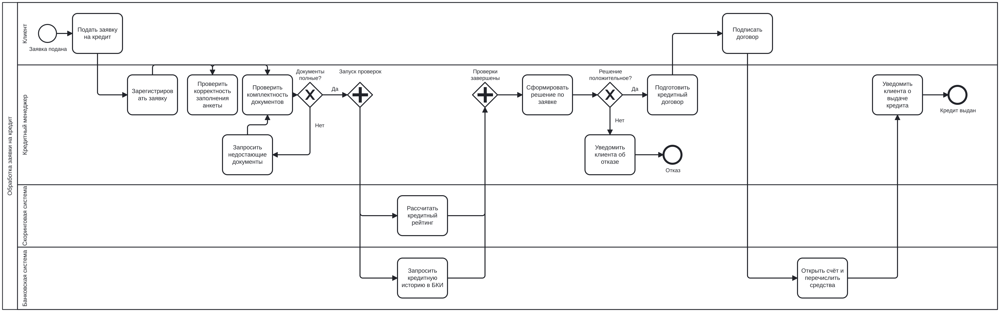
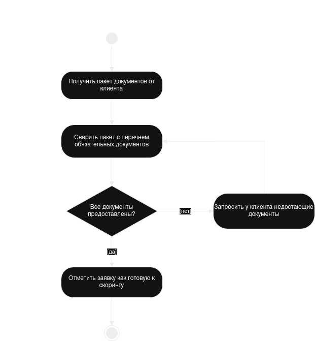

# Лабораторная работа №1

**Моделирование процессов с использованием Git и визуальных нотаций**

Выполнил: Коннов Андрей Анатольевич, группа СДП-241 ИИ

---

## 1. Цель работы

Настроить Git-репозиторий, освоить базовые команды и работу с графическими
нотациями (BPMN, UML Activity, Sequence, Flowchart), сохранить все артефакты
в репозитории и на практике увидеть разницу между текстовыми и бинарными
форматами при версионировании.

## 2. Описание процесса

Смоделирован бизнес-процесс **«Обработка заявки на кредит»**.

**Участники:** клиент, кредитный менеджер, скоринговая система, банковская система.

Клиент подаёт заявку с документами. Менеджер регистрирует её и проверяет
комплектность пакета; при нехватке документов они дозапрашиваются, и проверка
повторяется. Затем параллельно запускаются две независимые проверки — расчёт
кредитного рейтинга и запрос кредитной истории в БКИ. После завершения обеих
формируется решение: при отказе клиент уведомляется и процесс завершается,
при одобрении готовится договор, клиент его подписывает, банковская система
открывает счёт и перечисляет средства.

**Ключевые элементы модели:**

| Элемент | Где в процессе |
|---|---|
| Ветвление XOR №1 | Документы полные / неполные (с возвратом на повторную проверку) |
| Ветвление XOR №2 | Решение по заявке положительное / отрицательное |
| Параллельность AND | Скоринг и запрос кредитной истории выполняются одновременно |

Полное описание: [`docs/process_description.md`](docs/process_description.md)

## 3. Диаграммы

### 3.1 BPMN-диаграмма

Нотация BPMN 2.0, редактор [demo.bpmn.io](https://demo.bpmn.io).
Один пул с четырьмя дорожками по числу участников.

Состав: 1 стартовое событие, 13 задач, 2 шлюза XOR, 2 шлюза AND (split и join),
2 конечных события.

- Исходник: [`diagrams/process.bpmn`](diagrams/process.bpmn)
- Изображение: [`diagrams/process-bpmn.png`](diagrams/process-bpmn.png)



### 3.2 UML Activity Diagram

Нотация UML 2.x, редактор [diagrams.net](https://app.diagrams.net).
Детализирует шаг проверки комплектности документов — тот, где есть решение и цикл.

Состав: начальный узел, 5 действий, 1 решение с ветками `[да]` / `[нет]`,
конечный узел.

- Исходник: [`diagrams/activity.drawio`](diagrams/activity.drawio)
- Изображение: [`diagrams/activity-uml.png`](diagrams/activity-uml.png)



### 3.3 Sequence Diagram

Текстовая нотация Mermaid. Показывает обмен сообщениями между четырьмя
участниками на полном пути заявки.

Состав: 4 lifeline, 16 сообщений, блок `loop` (дозапрос документов),
блок `par` (параллельные проверки), блок `alt` / `else` (одобрение либо отказ).

Код: [`docs/sequence.md`](docs/sequence.md)

### 3.4 Flowchart

Текстовая нотация Mermaid, синтаксис `flowchart`. Описывает алгоритм принятия
решения скоринговой системой: последовательные проверки возраста, кредитной
истории, рейтинга и долговой нагрузки с пересчётом одобряемой суммы.

Код: [`docs/flowchart.md`](docs/flowchart.md)

## 4. Демонстрация diff

После внесения правок в диаграммы выполнено сравнение изменений.

```
lab1/diagrams/activity-uml.png | Bin 47574 -> 54886 bytes
 lab1/diagrams/flowchart.md     |   8 +++++++-
 lab1/diagrams/sequence.md      |   4 ++++
 3 files changed, 11 insertions(+), 1 deletion(-)
```

**Наблюдения по форматам:**

| Формат | Что показывает Git |
|---|---|
| `.bpmn` (XML) | Конкретные добавленные строки: новый `<bpmn:task>`, новый `<sequenceFlow>`, изменённый `targetRef` |
| `.md` (Mermaid) | Построчный diff, изменения читаются без редактора |
| `.drawio` (XML) | Diff есть, но зашумлён: редактор пересчитывает координаты узлов |
| `.png` (бинарный) | `Binary files ... differ` — детализация отсутствует |

## 5. Структура репозитория

```
visual-programming-labs-Konnov/
├── README.md
├── .gitignore
└── lab1/
    ├── report.md
    ├── docs/
    │   ├── process_description.md
    │   ├── sequence.md
    │   └── flowchart.md
    └── diagrams/
        ├── process.bpmn
        ├── process-bpmn.png
        ├── activity.drawio
        └── activity-uml.png
```

## 6. История коммитов

```
52e7523 (HEAD -> main, origin/main) Update diagrams: add validation steps to Activity, Sequence and Flowchart
027a5f8 Added minor element to BPMN diagram
6c8f9dc Added all diagrams (BPMN, UML Activity, Sequence, Flowchart)
253b8ac Add process description
6a78753 Initial commit: create repo structure
```

## 7. Выводы

```
git diff по PNG выдал Binary files a/... and b/... differ и больше ничего. Никакой информации о том, что изменилось. То, что картинку «сразу видно», - это веб-интерфейс GitHub рисует превью, а не Git сравнивает содержимое. Удобными в истории оказались .bpmn и .md - там видно конкретные добавленные строки.
редактор при сохранении пересчитывает координаты и порядок узлов, поэтому изменившихся строк больше
PNG нужен, чтобы диаграмму можно было посмотреть в отчёте и на GitHub, не устанавливая bpmn.io и draw.io. Исходник - для правок и diff, PNG - для просмотра.
BPMN показывает структуру процесса - кто участвует (дорожки), где ветвления, где параллельность. Sequence показывает то, чего в BPMN нет: порядок обмена сообщениями во времени и направление каждого вызова - кто кого дёрнул и что вернулось.

```